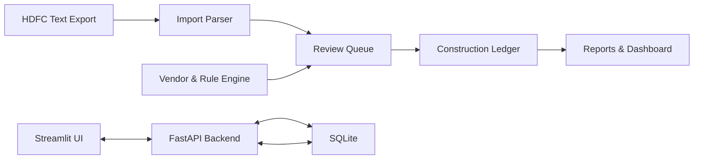

# Finance Engine

Finance Engine is a construction expense tracking application for importing HDFC bank statement exports, classifying construction-related transactions, reviewing uncertain matches, and producing clean ledgers and reports.

This first scaffold establishes the application foundation only. HDFC parsing, vendor matching, rule scoring, dashboards, and Excel exports are planned for later PRs.

## Architecture



## Stack

- Python 3.12+
- FastAPI backend
- Streamlit frontend
- SQLAlchemy and Alembic
- SQLite
- Pydantic settings
- Loguru
- uv

## Setup

```bash
uv sync
```

Copy `.env.example` to `.env` if you want local overrides.

## Commands

```bash
make api
make ui
make lint
make test
```

## Roadmap

- PR-001: Bootstrap project
- PR-002: HDFC text parser
- PR-003: Transaction import engine
- PR-004: Vendor and rule matching engine
- PR-005: Review workflow
- PR-006: Reports and dashboards
- PR-007: Excel export
